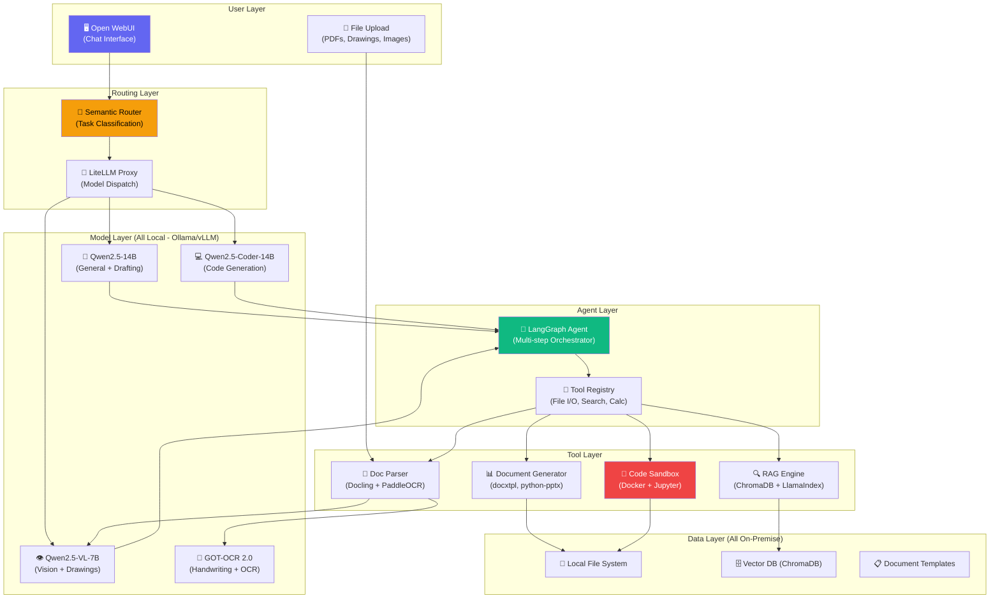
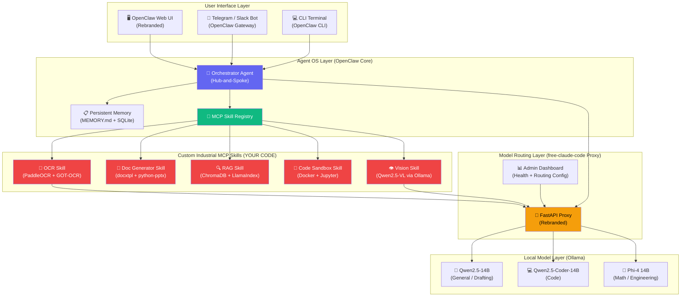

# 🏭 Sovereign Industrial AI Workbench — Full Research Report

> **Goal**: Build a self-hosted, air-gapped AI workbench for industrial organizations (refineries, PSUs, defence) for Smart India Hackathon — maximizing impact while minimizing custom code by assembling battle-tested open-source components.

---

## Table of Contents

1. [Executive Strategy: Maximum Impact, Minimum Effort](#1-executive-strategy)
2. [The 90/10 Architecture: What to Reuse vs. What to Build](#2-the-9010-architecture)
3. [Recommended Technology Stack](#3-recommended-technology-stack)
4. [Open-Weight Model Selection Guide](#4-model-selection-guide)
5. [Agent Framework & Orchestration](#5-agent-framework--orchestration)
6. [Multimodal Pipeline: OCR, Vision & Document Understanding](#6-multimodal-pipeline)
7. [Document Deliverable Generation](#7-document-deliverable-generation)
8. [Local RAG & Knowledge Base](#8-local-rag--knowledge-base)
9. [Code Sandbox & Execution](#9-code-sandbox--execution)
10. [Model Auto-Routing (The "Smart Brain" Feature)](#10-model-auto-routing)
11. [Air-Gap Proof: Network Isolation Verification](#11-air-gap-proof)
12. [SIH Winning Strategy & Judging Criteria](#12-sih-winning-strategy)
13. [Complete Bill of Materials (Open Source)](#13-bill-of-materials)
14. [Demo Scenarios for the Hackathon](#14-demo-scenarios)
15. [48-Hour Sprint Plan](#15-48-hour-sprint-plan)

---

## 1. Executive Strategy

### The Core Insight

> **You don't need to build an AI assistant from scratch. You need to _assemble_ one from production-grade open-source components and add the industrial-specific glue.**

The open-source ecosystem in 2025–2026 has matured to the point where every major capability you need already exists as a deployable, self-hosted component:

| Capability | Open-Source Solution That Already Exists | Your Custom Work |
|:---|:---|:---|
| Chat UI + Multi-model support | **Open WebUI** or **LibreChat** | Zero — just configure |
| Model serving (multiple models) | **Ollama** (simple) or **vLLM** (production) | Zero — just deploy |
| Agentic multi-step workflows | **LangGraph** / **smolagents** / **CrewAI** | Light glue code |
| Code execution sandbox | **Docker + Jupyter Kernel Gateway** | Configuration only |
| OCR & Document parsing | **PaddleOCR** + **Docling** (IBM) + **GOT-OCR 2.0** | Pipeline wiring |
| Vision / Drawing comprehension | **Qwen2.5-VL-7B** (runs on 6GB VRAM) | Zero — use via Ollama |
| RAG / Knowledge base | **ChromaDB** or **Qdrant** + **LlamaIndex** | Index your docs |
| Word/PPT/Excel generation | **docxtpl** / **python-pptx** / **openpyxl** | Template design |
| Model auto-routing | **Semantic Router** + **LiteLLM** | ~100 lines of config |
| Network isolation proof | `tcpdump` / **Wireshark** / `iptables` | Script + demo |

> [!TIP]
> **The 90/10 Rule**: ~90% of your system is off-the-shelf open source. Your ~10% of custom work is the **industrial-domain glue**: prompt engineering for industrial tasks, document templates for government/PSU formats, model routing rules, and the demo pipeline connecting everything.

---

## 2. The 90/10 Architecture

### System Architecture Diagram



### What You Build vs. What You Reuse

```
YOUR CUSTOM CODE (~10%)                    OPEN SOURCE YOU ASSEMBLE (~90%)
┌────────────────────────────┐             ┌────────────────────────────────┐
│ • Routing rules config     │             │ • Open WebUI (Full Chat UI)    │
│ • Industrial prompt library│             │ • Ollama (Model Management)    │
│ • Document templates (.docx│             │ • LangGraph (Agent Framework)  │
│   .pptx with PSU branding) │             │ • ChromaDB (Vector Search)     │
│ • Pipeline glue scripts    │             │ • LlamaIndex (RAG Engine)      │
│ • Demo scenario data       │             │ • Docling (PDF/Doc Parser)     │
│ • Air-gap verification     │             │ • PaddleOCR (OCR Engine)       │
│   script                   │             │ • GOT-OCR 2.0 (Handwriting)   │
│                            │             │ • docxtpl (Word Generation)    │
│                            │             │ • python-pptx (PPT Generation) │
│                            │             │ • Docker (Code Sandbox)        │
│                            │             │ • Semantic Router (Routing)    │
│                            │             │ • LiteLLM (Model Proxy)        │
│                            │             │ • Qwen2.5 / DeepSeek models    │
└────────────────────────────┘             └────────────────────────────────┘
```

---

## 3. Recommended Technology Stack

### The "Hackathon-Ready" Stack (Optimized for 36-hour build)

| Layer | Component | Why This One |
|:---|:---|:---|
| **Frontend/UI** | **Open WebUI** | Plug-and-play ChatGPT-like UI. Connects to Ollama natively. Built-in RAG, vision support, multi-model chat, arena mode. Zero frontend code needed. |
| **Model Server** | **Ollama** | One-command model downloads (`ollama pull qwen2.5:14b`). OpenAI-compatible API. Handles multi-model concurrency. Dead-simple on hackathon hardware. |
| **Agent Framework** | **LangGraph** (primary) + **smolagents** (lightweight tasks) | LangGraph for complex multi-step workflows with checkpointing. smolagents for quick code-execution tasks with 30-50% fewer LLM roundtrips. |
| **Model Routing** | **Semantic Router** + LiteLLM | <10ms routing decisions. No LLM call needed for classification. LiteLLM handles fallbacks and load balancing. |
| **RAG** | **ChromaDB** + **LlamaIndex** | ChromaDB is zero-setup (`pip install chromadb`). LlamaIndex has native Docling integration for table-preserving ingestion. |
| **Document Parsing** | **Docling** (IBM) + **PaddleOCR** | Docling preserves tables perfectly (TableFormer). PaddleOCR handles rotated text on engineering drawings. |
| **Vision** | **Qwen2.5-VL-7B** via Ollama | Native dynamic resolution (no downscaling). Pixel-level grounding. Only ~6GB VRAM at Q4. |
| **OCR (Handwriting)** | **GOT-OCR 2.0** | Best-in-class on handwritten notes (F1 ~88%). Outputs clean Markdown. |
| **Document Generation** | **docxtpl** + **python-pptx** + **openpyxl** | Template-injection pattern: LLM outputs JSON → fills branded Word/PPT/Excel templates. |
| **Code Sandbox** | **Docker** + **Jupyter Kernel Gateway** | Stateful Python execution in isolated containers. Variables persist across steps. |
| **Network Proof** | `tcpdump` + `iptables`/`pf` | Real-time proof that zero packets leave the machine. |

---

## 4. Model Selection Guide

### What Fits on Your Hardware

> [!IMPORTANT]
> **For a hackathon demo**, you likely have a **single GPU with 8-24GB VRAM**. Here's exactly what to run:

#### Option A: Single 24GB GPU (RTX 4090 / A5000) — "The Full Stack"

Run **all models simultaneously** on one GPU:

| Model | Role | VRAM (Q4) | Notes |
|:---|:---|:---|:---|
| **Qwen2.5-14B-Instruct** | General reasoning, drafting, tool calling | ~9.2 GB | Best function-calling among open models |
| **Qwen2.5-VL-7B** | Vision, drawing comprehension | ~5.5 GB | Dynamic resolution, no downscaling |
| **BGE-M3** (embedding) | RAG embeddings | ~1.2 GB | Multilingual, dense+sparse |
| *Total* | | *~16 GB* | *Leaves 8GB for KV cache + overhead* |

#### Option B: Single 8-12GB GPU (RTX 3060/4060/4070) — "The Lean Stack"

| Model | Role | VRAM (Q4) | Notes |
|:---|:---|:---|:---|
| **Qwen2.5-7B-Instruct** | General + Code (combined) | ~5.0 GB | 84% HumanEval, 128k context |
| **PaddleOCR** (CPU) | OCR | 0 GB (CPU) | <50ms/page on CPU |
| **nomic-embed-text** (CPU) | Embeddings | 0 GB (CPU) | Runs on CPU via Ollama |
| *Total* | | *~5 GB* | *Plenty of room for long context* |

#### Option C: Apple Silicon (M2/M3/M4 Pro/Max) — "The Mac Advantage"

| Model | Role | Unified Memory | Notes |
|:---|:---|:---|:---|
| **Qwen2.5-Coder-32B** (Q4) | Heavy reasoning + code | ~19 GB | Fits easily on 32GB+ Mac |
| **Qwen2.5-VL-7B** (Q4) | Vision | ~5.5 GB | |
| **Qwen2.5-7B** (Q4) | Fast triage | ~5 GB | |
| *Total* | | *~30 GB* | *Runs on M3 Pro 36GB or M4 Max* |

### Model Capability Matrix

| Task Type | Best Model | Why | Fallback |
|:---|:---|:---|:---|
| **Approval note drafting** | Qwen2.5-14B/32B | Best instruction following + long context | Qwen2.5-7B |
| **Code generation (Python, SQL)** | Qwen2.5-Coder-32B (92.7% HumanEval) | Undisputed king of open-weight coding | Qwen2.5-Coder-14B |
| **Engineering calculations** | Phi-4 (14B) or DeepSeek-R1-Distill-32B | Best STEM/math density | Qwen2.5-14B |
| **Reading scanned documents** | Qwen2.5-VL-7B + PaddleOCR | Dynamic resolution + rotated text handling | MiniCPM-V 2.6 |
| **Handwritten notes** | GOT-OCR 2.0 | F1 ~88% on messy handwriting | PaddleOCR with handwriting weights |
| **Engineering drawings (P&ID)** | Florence-2 (detect regions) → Qwen2.5-VL-7B (interpret) | Two-stage pipeline prevents hallucination | PaddleOCR PP-Structure |
| **Document summarization** | Qwen2.5-14B (128k context) | Can ingest entire 300-page manuals | Llama-3.1-8B |
| **Tool calling / Function calling** | Qwen2.5-14B/32B | Most robust JSON schema compliance | Llama-3.3-8B |

---

## 5. Agent Framework & Orchestration

### Why LangGraph is the Right Choice

LangGraph gives you **maximum control** with **minimum magic**:

```python
from langgraph.graph import StateGraph, MessagesState, START, END
from langchain_ollama import ChatOllama

# Connect to local Ollama — zero cloud dependency
llm = ChatOllama(model="qwen2.5:14b", base_url="http://localhost:11434")

# Define the agent workflow as a state machine
workflow = StateGraph(MessagesState)
workflow.add_node("reason", call_model)       # LLM thinks
workflow.add_node("tools", execute_tools)     # Run file I/O, OCR, search
workflow.add_node("generate", create_output)  # Generate Word/PPT file

# Cyclic: reason → tools → reason → ... → generate → END
workflow.add_edge(START, "reason")
workflow.add_conditional_edges("reason", should_continue, {
    "tools": "tools",
    "generate": "generate"
})
workflow.add_edge("tools", "reason")
workflow.add_edge("generate", END)

agent = workflow.compile()
```

### Available Tool Registry

Your agent needs these tools to be genuinely useful in industrial settings:

| Tool | Implementation | What It Does |
|:---|:---|:---|
| `read_file` | Python `pathlib` | Read local documents, configs, data files |
| `write_file` | Python `pathlib` | Write outputs (intermediate results, logs) |
| `ocr_document` | PaddleOCR + Docling | Extract text from scanned PDFs/images |
| `analyze_image` | Qwen2.5-VL-7B via Ollama | Understand photos, drawings, schematics |
| `search_knowledge_base` | ChromaDB + LlamaIndex | RAG search over organization's documents |
| `run_code` | Jupyter Kernel Gateway (Docker) | Execute Python/SQL in sandbox |
| `generate_word_doc` | docxtpl | Create formatted Word documents |
| `generate_ppt` | python-pptx | Create presentation slide decks |
| `generate_excel` | openpyxl | Create spreadsheets with formulas |
| `web_search` | *Disabled (air-gapped)* | Intentionally blocked — proves sovereignty |

### smolagents for Quick Tasks

For simpler tasks (calculations, data transforms), smolagents is 30-50% more token-efficient because the LLM writes Python directly instead of JSON tool calls:

```python
from smolagents import CodeAgent, Tool, LiteLLMModel

model = LiteLLMModel(model_id="ollama_chat/qwen2.5:14b")
agent = CodeAgent(tools=[search_tool, calculator_tool], model=model)

# The LLM writes: result = calculator_tool("pipe_diameter * 3.14159 * flow_rate")
# Instead of: {"tool": "calculator", "args": {"expression": "..."}}
# → Fewer roundtrips, faster execution
```

---

## 6. Multimodal Pipeline

### The Two-Stage Engineering Drawing Pipeline

Engineering drawings are too complex for a single VLM pass. Use a two-stage approach:

```
┌─────────────────────────────┐
│   Original P&ID Drawing     │
│   (4K/8K, A0/A2 size)       │
└──────────────┬──────────────┘
               │
               ▼
┌─────────────────────────────┐
│ Stage 1: Layout Detection   │
│ • Florence-2 or PaddleOCR   │
│   PP-Structure              │
│ • Segments into regions:    │
│   - Title Block             │
│   - Bill of Materials (BOM) │
│   - Drawing Viewports       │
│   - Legend / Notes           │
└──────────────┬──────────────┘
               │ Cropped ROI images
               ▼
┌─────────────────────────────┐
│ Stage 2: Semantic Analysis  │
│ • Qwen2.5-VL-7B processes   │
│   each region with domain   │
│   prompts:                  │
│   "Extract all valve tag    │
│    numbers connected to     │
│    Line 101"                │
│ • Returns structured JSON   │
└──────────────┬──────────────┘
               │
               ▼
┌─────────────────────────────┐
│ Structured Output           │
│ • Tag numbers, equipment    │
│ • Connections, line sizes   │
│ • Material specs from BOM   │
└─────────────────────────────┘
```

### OCR Decision Tree

```
Incoming Document
      │
      ├── Is it a scanned PDF/image with printed text?
      │     └── YES → PaddleOCR PP-OCRv4 (<50ms/page, handles rotation)
      │
      ├── Is it handwritten notes / field inspection forms?
      │     └── YES → GOT-OCR 2.0 (best handwriting recognition)
      │
      ├── Is it a complex multi-column report with tables?
      │     └── YES → Docling (IBM) with TableFormer (preserves table structure)
      │
      ├── Is it an engineering drawing / P&ID?
      │     └── YES → PaddleOCR PP-Structure (rotated text) + Qwen2.5-VL (semantics)
      │
      └── Is it a digital PDF (text-selectable)?
            └── YES → Direct text extraction (PyMuPDF/pdfplumber) — no OCR needed
```

---

## 7. Document Deliverable Generation

> [!IMPORTANT]
> **This is your killer demo feature.** SIH judges see dozens of chatbots. Show them the agent producing a **ready-to-sign Government Approval Note in Word** and a **Board Presentation in PowerPoint** — downloaded in 10 seconds.

### Pattern: Template-Injection Architecture

```
┌─────────────────────────┐
│  LLM generates structured│
│  JSON (via Pydantic)     │
│                          │
│  {                       │
│    "title": "...",       │
│    "executive_summary":  │
│      "...",              │
│    "findings": [         │
│      {"item": "...",     │
│       "status": "..."}   │
│    ],                    │
│    "recommendation": "." │
│  }                       │
└────────────┬────────────┘
             │
             ▼
┌─────────────────────────┐     ┌─────────────────────────┐
│  docxtpl Engine          │     │  python-pptx Engine      │
│                          │     │                          │
│  template.docx contains: │     │  template.pptx contains: │
│  {{ title }}             │     │  Slide Layouts:           │
│  {{ executive_summary }} │     │  • Title Slide (layout 0) │
│   │     │  • Bullet Slide (1)       │
│    {{ f.item }}          │     │  • Chart Slide (2)        │
│              │     │  • Two-Column (3)         │
│                          │     │                          │
│  → Preserves fonts,      │     │  → Uses native PowerPoint │
│    headers, letterhead,  │     │    placeholders           │
│    page numbers          │     │                          │
└─────────────────────────┘     └─────────────────────────┘
```

### Key Libraries

| Library | Format | Install | Use Case |
|:---|:---|:---|:---|
| **`docxtpl`** | `.docx` (Word) | `pip install docxtpl` | Approval notes, memos, reports with Jinja2 templates |
| **`python-pptx`** | `.pptx` (PowerPoint) | `pip install python-pptx` | Board presentations using slide master layouts |
| **`openpyxl`** | `.xlsx` (Excel) | `pip install openpyxl` | Inspection data, calculation sheets with formulas |
| **`WeasyPrint`** | `.pdf` | `pip install weasyprint` | Branded PDF reports via CSS Paged Media |
| **`Pandoc`** | Universal | `brew install pandoc` | Markdown → Word/PDF with reference templates |

---

## 8. Local RAG & Knowledge Base

### Recommended Stack for Hackathon

```python
# 1. Parse documents with Docling (preserves tables!)
from llama_index.readers.docling import DoclingReader
from llama_index.node_parser.docling import DoclingNodeParser

reader = DoclingReader(export_type=DoclingReader.ExportType.JSON)
docs = reader.load_data("company_SOPs/")

# 2. Chunk respecting layout boundaries
parser = DoclingNodeParser()
nodes = parser.get_nodes_from_documents(docs)

# 3. Embed locally (zero cloud calls)
from llama_index.embeddings.huggingface import HuggingFaceEmbedding
embed_model = HuggingFaceEmbedding(model_name="BAAI/bge-small-en-v1.5")

# 4. Store in ChromaDB (zero setup, runs in-process)
import chromadb
from llama_index.vector_stores.chroma import ChromaVectorStore
from llama_index.core import VectorStoreIndex, StorageContext

chroma_client = chromadb.PersistentClient(path="./local_chromadb")
collection = chroma_client.get_or_create_collection("industrial_docs")
vector_store = ChromaVectorStore(chroma_collection=collection)

index = VectorStoreIndex(nodes, embed_model=embed_model,
                         storage_context=StorageContext.from_defaults(vector_store=vector_store))

# 5. Query with citations
query_engine = index.as_query_engine(llm=local_ollama_llm, similarity_top_k=5)
response = query_engine.query("What is the pressure test procedure for Line 101?")
```

### Vector DB Comparison (Quick Reference)

| Database | Setup Effort | Best For | RAM Usage |
|:---|:---|:---|:---|
| **ChromaDB** | `pip install chromadb` | **Hackathon MVP** — zero infrastructure | ~100MB idle |
| **Qdrant** | Docker or `pip install qdrant-client` | **Production** — hybrid BM25 + dense search | Low (Rust, memory-mapped) |
| **FAISS** | `pip install faiss-cpu` | Raw speed, GPU-accelerated search | Extremely low |

---

## 9. Code Sandbox & Execution

### Docker + Jupyter Kernel Gateway (Recommended)

```yaml
# docker-compose.yml for the code sandbox
services:
  code-sandbox:
    image: jupyter/scipy-notebook:latest
    command: jupyter kernelgateway --KernelGatewayApp.api='kernel_gateway.notebook_http'
    ports:
      - "8888:8888"
    networks:
      - no-internet  # Air-gapped!
    deploy:
      resources:
        limits:
          memory: 2G
          cpus: '1.0'
    volumes:
      - ./workspace:/home/jovyan/work

networks:
  no-internet:
    driver: bridge
    internal: true  # No external access
```

### Why Jupyter Kernel Gateway?

- **Stateful**: Variables from Step 1 persist in Step 2 (unlike exec-and-discard)
- **Multi-language**: Python, R, Julia kernels available
- **Isolated**: Runs inside Docker with `internal: true` network (no internet)
- **API-accessible**: REST/WebSocket API for programmatic code execution

> [!CAUTION]
> **Never use `RestrictedPython` as your sole sandbox.** It does NOT protect against memory bombs (`[0] * 10**10`), infinite loops, or C-extension escapes. Always use Docker or gVisor container isolation.

---

## 10. Model Auto-Routing

### Semantic Router: <10ms Task Classification

This is the "smart brain" feature that auto-selects the right model for each task. It uses vector similarity — no LLM call needed for routing:

```python
from semantic_router import Route, RouteLayer
from semantic_router.encoders import HuggingFaceEncoder

# Local encoder — no cloud calls
encoder = HuggingFaceEncoder(name="sentence-transformers/all-MiniLM-L6-v2")

# Define routes with example utterances
coding_route = Route(
    name="coding",
    utterances=[
        "write a Python script to parse CSV",
        "debug this SQL query",
        "create a function to calculate pipe flow",
        "fix the error in this PLC code",
        "generate a REST API endpoint",
    ]
)

document_route = Route(
    name="document_drafting",
    utterances=[
        "draft an approval note for the procurement",
        "write a board presentation on Q3 results",
        "summarize this inspection report",
        "create a memo about the safety audit",
        "prepare minutes of the meeting",
    ]
)

vision_route = Route(
    name="vision_analysis",
    utterances=[
        "read this scanned document",
        "analyze this engineering drawing",
        "extract text from this photo",
        "what does this P&ID diagram show",
        "identify equipment in this image",
    ]
)

calculation_route = Route(
    name="engineering_calculation",
    utterances=[
        "calculate the pressure drop across the valve",
        "what is the heat transfer coefficient",
        "compute the stress on this beam",
        "determine the flow rate for this pipe diameter",
    ]
)

# Build the router
router = RouteLayer(
    encoder=encoder,
    routes=[coding_route, document_route, vision_route, calculation_route]
)

# Route a query in <10ms
result = router("write a script to read sensor data from the historian")
# → result.name = "coding" → dispatch to Qwen2.5-Coder-14B

result = router("draft the approval note for vendor XYZ")
# → result.name = "document_drafting" → dispatch to Qwen2.5-14B
```

### Route-to-Model Mapping

| Route | Model | Reasoning |
|:---|:---|:---|
| `coding` | Qwen2.5-Coder-14B/32B | Specialized coding architecture, 92.7% HumanEval |
| `document_drafting` | Qwen2.5-14B/32B | Best instruction following, 128k context |
| `vision_analysis` | Qwen2.5-VL-7B | Native dynamic resolution, bounding box grounding |
| `engineering_calculation` | Phi-4 (14B) or DeepSeek-R1-Distill | STEM-focused training, explicit chain-of-thought |
| *fallback* | Qwen2.5-7B | Fast, general-purpose |

---

## 11. Air-Gap Proof

> [!IMPORTANT]
> **This is the single most important demo feature for SIH judges.** Every other team will claim "local deployment." You must **prove** it with live network monitoring.

### Three Layers of Proof

#### Layer 1: Firewall Block (Prevention)

```bash
# macOS: Block ALL outbound traffic from the AI stack
sudo pfctl -e
echo "block out on en0 proto tcp from any to any" | sudo pfctl -f -

# Linux: iptables
sudo iptables -A OUTPUT -m owner --uid-owner ai-user -j DROP
```

#### Layer 2: Live Network Monitor (Detection)

```bash
# Terminal 1: Run tcpdump during the demo — show it on a separate screen
sudo tcpdump -i any -n \
  --immediate-mode \
  -l \
  'not (dst net 127.0.0.0/8 or dst net 10.0.0.0/8 or dst net 172.16.0.0/12 or dst net 192.168.0.0/16)' \
  2>&1 | tee /tmp/network_log.txt

# If this terminal shows ZERO packets during the entire demo,
# that's irrefutable proof of air-gapped operation
```

#### Layer 3: Docker Network Isolation (Architectural)

```yaml
# All AI services run on an internal-only Docker network
networks:
  airgapped:
    driver: bridge
    internal: true  # Docker prevents ALL external routing
```

#### Layer 4: Post-Demo Verification Script

```bash
#!/bin/bash
echo "=== AIR-GAP VERIFICATION REPORT ==="
echo "Demo duration: $(cat /tmp/demo_start) to $(date)"
echo ""
echo "External packets captured: $(wc -l < /tmp/network_log.txt)"
echo ""
if [ $(wc -l < /tmp/network_log.txt) -eq 0 ]; then
    echo "✅ VERIFIED: Zero external network calls during entire demo"
    echo "✅ All AI processing was 100% on-premise"
else
    echo "❌ WARNING: External calls detected — investigate"
    cat /tmp/network_log.txt
fi
```

---

## 12. SIH Winning Strategy

### Judging Criteria (What Actually Gets Scored)

| Pillar | Weight | What Judges Look For | Your Counter-Strategy |
|:---|:---|:---|:---|
| **Problem Understanding** | 20% | Deep domain knowledge of ministry/PSU workflows | Use real industrial terminology: "GFR 2017 compliance", "RTI Section 4", "GeM portal", "OISD standards" |
| **Novelty & Innovation** | 20% | Beyond a vanilla ChatGPT wrapper | Hybrid search, Docling table parsing, one-click deliverable generation, model auto-routing |
| **Technical Architecture** | 20% | Clean, modular, resilient system design | Show the architecture diagram. Explain why each component was chosen. |
| **Working Prototype** | 20% | **Live, stable end-to-end demo** | Pre-index sample docs. Have local fallback ready. Never depend on WiFi. |
| **Real-World Impact** | 10% | Deployability, cost, scalability | "Runs on a ₹2L workstation. Zero API costs. Zero data leaks." |
| **Presentation** | 10% | Clear pitch, handle grilling | One presenter, one architect, one demo driver. |

### 4 Killer Differentiators to Win

> [!TIP]
> **Differentiator 1: Never stop at "Chat"**
> Judges see dozens of chatbot demos. Generate a **Government Memorandum (.docx)** and a **Board Briefing Deck (.pptx)** — downloadable in 10 seconds. This alone puts you in the top 5%.

> [!TIP]
> **Differentiator 2: Preserve Tables Accurately**
> Use Docling (not basic pypdf). Demo a multi-page table from a procurement document being parsed with zero column corruption.

> [!TIP]
> **Differentiator 3: Source Grounding with Citations**
> Show side-by-side: the AI answer with clickable citations → highlighting the exact paragraph in the original PDF. Judges love verifiability.

> [!TIP]
> **Differentiator 4: Live Air-Gap Proof**
> Run `tcpdump` on a separate monitor throughout the demo. At the end, show "0 external packets captured." No other team will do this.

---

## 13. Bill of Materials

### Complete Open-Source Stack

| Component | License | Install | Purpose |
|:---|:---|:---|:---|
| **Ollama** | MIT | `curl -fsSL https://ollama.ai/install.sh \| sh` | Model serving |
| **Open WebUI** | MIT | `docker run -d -p 3000:8080 ghcr.io/open-webui/open-webui:main` | Chat interface |
| **Qwen2.5-14B-Instruct** | Apache 2.0 | `ollama pull qwen2.5:14b` | General reasoning |
| **Qwen2.5-Coder-14B** | Apache 2.0 | `ollama pull qwen2.5-coder:14b` | Code generation |
| **Qwen2.5-VL-7B** | Apache 2.0 | `ollama pull qwen2.5-vl:7b` (or via vLLM) | Vision + drawings |
| **LangGraph** | MIT | `pip install langgraph langchain-ollama` | Agent orchestration |
| **smolagents** | Apache 2.0 | `pip install smolagents` | Lightweight agents |
| **ChromaDB** | Apache 2.0 | `pip install chromadb` | Vector database |
| **LlamaIndex** | MIT | `pip install llama-index` | RAG framework |
| **Docling** | MIT | `pip install docling` | PDF/Doc parsing |
| **PaddleOCR** | Apache 2.0 | `pip install paddleocr paddlepaddle` | OCR engine |
| **GOT-OCR 2.0** | Apache 2.0 | Clone from GitHub | Handwriting OCR |
| **Semantic Router** | MIT | `pip install semantic-router` | Task classification |
| **LiteLLM** | MIT | `pip install litellm` | Model proxy |
| **docxtpl** | MIT | `pip install docxtpl` | Word generation |
| **python-pptx** | MIT | `pip install python-pptx` | PowerPoint generation |
| **openpyxl** | MIT | `pip install openpyxl` | Excel generation |
| **WeasyPrint** | BSD | `pip install weasyprint` | PDF generation |
| **Docker** | Apache 2.0 | Standard install | Code sandbox |
| **Jupyter KernelGateway** | BSD | `pip install jupyter_kernel_gateway` | Code execution API |
| **Aider** | Apache 2.0 | `pip install aider-chat` | Git-native coding agent |
| **Continue.dev** | Apache 2.0 | VS Code extension | IDE copilot |

> **Total licensing cost: ₹0**
> **Total cloud API cost: ₹0/month**
> **Estimated hardware: Single workstation with RTX 4090 (~₹2L) or any NVIDIA GPU ≥8GB VRAM**

---

## 14. Demo Scenarios for the Hackathon

### Demo 1: Agentic Document Processing (End-to-End)

**Scenario**: "Read this scanned inspection report, extract key findings, and draft an approval note as a Word file."

```
Step 1: User uploads scanned_inspection_report.pdf
Step 2: Agent routes to OCR pipeline (PaddleOCR → Docling)
Step 3: Extracted text + tables sent to Qwen2.5-14B
Step 4: Agent searches knowledge base for relevant SOPs
Step 5: LLM drafts approval note with citations
Step 6: docxtpl fills branded Word template
Step 7: User downloads "Approval_Note_2026.docx"

Total time: ~30-45 seconds
```

### Demo 2: Coding Task with Sandbox Verification

**Scenario**: "Write a Python script to calculate pressure drop using Darcy-Weisbach equation, then run and verify it."

```
Step 1: Semantic Router → "coding" route → Qwen2.5-Coder-14B
Step 2: LLM generates Python script with engineering formulas
Step 3: Code sent to Docker sandbox via Jupyter Kernel Gateway
Step 4: Execution output captured (calculated values)
Step 5: Agent verifies output against expected ranges
Step 6: Returns code + results + explanation with formulas shown

Total time: ~15-20 seconds
```

### Demo 3: Multimodal Drawing Analysis

**Scenario**: "Analyze this P&ID drawing and list all control valves on Line 201."

```
Step 1: User uploads P&ID_Line201.png (high-res scan)
Step 2: Semantic Router → "vision_analysis" → Qwen2.5-VL-7B
Step 3: PaddleOCR extracts tag numbers and text blocks
Step 4: Qwen2.5-VL-7B interprets valve symbols and connections
Step 5: Agent cross-references with knowledge base (equipment list)
Step 6: Returns structured table of valves + their specifications

Total time: ~20-30 seconds
```

### Demo 4: Model Auto-Routing (Live)

**Scenario**: Show three different queries being automatically routed to different models.

```
Query 1: "Draft minutes of the safety committee meeting" 
  → Semantic Router: "document_drafting" → Qwen2.5-14B ✅

Query 2: "Write a Python function to parse SCADA alarm logs"
  → Semantic Router: "coding" → Qwen2.5-Coder-14B ✅

Query 3: "What does this instrument drawing show?" [+ image]
  → Semantic Router: "vision_analysis" → Qwen2.5-VL-7B ✅

Show routing logs on screen proving different models were called.
```

---

## 15. 48-Hour Sprint Plan

### Hour 0–6: Foundation Setup

- [ ] Install Ollama, pull models (Qwen2.5-14B, Qwen2.5-Coder-14B, Qwen2.5-VL-7B)
- [ ] Deploy Open WebUI via Docker
- [ ] Set up Docker network with `internal: true` for air-gap
- [ ] Verify all models respond locally
- [ ] Set up `tcpdump` monitoring script

### Hour 6–12: Core Pipeline

- [ ] Set up ChromaDB + LlamaIndex RAG pipeline
- [ ] Index sample industrial documents (SOPs, manuals, inspection reports)
- [ ] Install PaddleOCR + Docling for document parsing
- [ ] Build OCR → RAG ingestion pipeline
- [ ] Test document upload → extraction → search flow

### Hour 12–20: Agent & Routing

- [ ] Implement Semantic Router with 4 routes (code, docs, vision, calc)
- [ ] Build LangGraph agent with tool registry
- [ ] Connect tools: file I/O, OCR, RAG search, code sandbox
- [ ] Set up Jupyter Kernel Gateway in Docker for code execution
- [ ] Test end-to-end agent workflow (user query → multi-step → output)

### Hour 20–28: Document Generation

- [ ] Design Word template (approval_note_template.docx) with PSU branding
- [ ] Design PowerPoint template with slide masters
- [ ] Implement docxtpl + python-pptx generation from LLM JSON output
- [ ] Build the full pipeline: query → agent → LLM → JSON → template → .docx/.pptx
- [ ] Test with real industrial scenarios

### Hour 28–36: Multimodal + Polish

- [ ] Test Qwen2.5-VL-7B with engineering drawings
- [ ] Build the two-stage P&ID analysis pipeline
- [ ] Integration test all 4 demo scenarios
- [ ] Build demo data set (sample reports, drawings, SOPs)
- [ ] Air-gap verification: run full demo with tcpdump showing zero external calls

### Hour 36–48: Demo Prep

- [ ] Record backup demo video (in case of hardware failure)
- [ ] Prepare architecture diagram slide
- [ ] Practice 10-minute pitch (3 rounds of practice)
- [ ] Assign roles: presenter, architect (handles technical grilling), demo driver
- [ ] Prepare printed air-gap verification report as handout for judges

---

## Appendix A: Key GitHub Repositories

| Repository | Stars | URL | Purpose |
|:---|:---|:---|:---|
| Open WebUI | 80k+ | `github.com/open-webui/open-webui` | Chat interface |
| Ollama | 120k+ | `github.com/ollama/ollama` | Model serving |
| LangGraph | 10k+ | `github.com/langchain-ai/langgraph` | Agent framework |
| smolagents | 15k+ | `github.com/huggingface/smolagents` | Lightweight agents |
| Docling | 20k+ | `github.com/docling-project/docling` | Document parsing |
| PaddleOCR | 45k+ | `github.com/PaddlePaddle/PaddleOCR` | OCR engine |
| ChromaDB | 18k+ | `github.com/chroma-core/chroma` | Vector database |
| LlamaIndex | 40k+ | `github.com/run-llama/llama_index` | RAG framework |
| Aider | 30k+ | `github.com/Aider-AI/aider` | Coding agent |
| OpenHands | 50k+ | `github.com/All-Hands-AI/OpenHands` | Autonomous coding |
| Semantic Router | 2k+ | `github.com/aurelio-labs/semantic-router` | Task routing |
| LiteLLM | 15k+ | `github.com/BerriAI/litellm` | Model proxy |
| Goose | 5k+ | `github.com/block/goose` | CLI agent (MCP native) |
| Continue.dev | 25k+ | `github.com/continuedev/continue` | IDE copilot |
| Dify | 60k+ | `github.com/langgenius/dify` | AI workflow platform |
| GOT-OCR | 8k+ | `github.com/Ucas-HaoranWei/GOT-OCR2.0` | Handwriting OCR |

## Appendix B: Claude Code Design Patterns You Can Reuse

The open-source community has extracted and published Claude Code's architectural patterns. Key reusable ideas:

1. **`CLAUDE.md` → `PROJECT.md`**: Create a project memory file at repo root that your agent reads on startup — containing build commands, style guides, and domain rules. Aider already does this with its repo-map.

2. **Sub-Agent Architecture**: Claude Code uses specialized sub-agents (Explore, Plan, Execute). Implement the same with LangGraph:
   - **Explore Node**: Fast, read-only — grep files, read docs
   - **Plan Node**: Generate multi-step implementation plan
   - **Execute Node**: Make changes, run tests, iterate

3. **MCP Integration**: Both Goose and Continue.dev implement MCP natively. You can expose your industrial tools (database queries, SCADA connectors) as MCP servers that any agent can call.

---

> [!NOTE]
> **Bottom Line**: This project is 90% assembly of best-in-class open-source components and 10% industrial-domain customization. The open-source AI ecosystem has done the hard engineering work. Your job is to curate, connect, and contextualize it for the industrial domain. That's what makes this both achievable in a hackathon timeframe and genuinely impressive to judges.


---

# 🔥 Integration Strategy: free-claude-code + OpenClaw → Industrial AI OS

> **TL;DR**: Fork both (MIT licensed), rebrand as your project, wire them together with custom industrial MCP skills. You get a full autonomous AI operating system with local model routing, OS-level automation, and industrial document workflows — with ~80% of the code already written.

---

## 1. What Each Project Gives You

### free-claude-code — The Model Routing Proxy

| Aspect | Details |
|:---|:---|
| **What it is** | A Python/FastAPI reverse proxy that emulates Anthropic's API |
| **Core trick** | Intercepts Claude Code CLI/VSCode calls, reroutes to **any backend** |
| **Supported backends** | Ollama, LM Studio, llama.cpp, vLLM, NVIDIA NIM, DeepSeek, OpenRouter, 17+ providers |
| **Key features** | Per-model routing, streaming, tool-use passthrough, reasoning block parsing, admin dashboard |
| **Language** | Python (FastAPI + uvicorn) |
| **License** | MIT ✅ (fork + rebrand allowed) |
| **Repo** | [github.com/alishahryar1/free-claude-code](https://github.com/alishahryar1/free-claude-code) |

#### What This Means for Your Project
You get a **ready-made multi-model router** that already handles:
- ✅ Mapping different "model tiers" (Opus → heavy local model, Haiku → light local model)
- ✅ OpenAI-compatible API translation
- ✅ Streaming responses with tool-calling support
- ✅ Admin UI for health checks and configuration
- ✅ Works with Ollama out of the box — just point it at `localhost:11434`

**You just reconfigure it**: Instead of routing to cloud providers, ALL routes point to local Ollama models.

---

### OpenClaw — The Autonomous Agent OS

| Aspect | Details |
|:---|:---|
| **What it is** | A self-hosted autonomous AI agent framework — acts as a "personal AI operating system" |
| **Core design** | Gateway-centric control plane connecting AI models to your system + messaging |
| **Key capabilities** | File read/write, shell execution, browser automation (CDP), email, persistent memory, multi-agent orchestration |
| **MCP Integration** | Deep MCP support — every skill runs as an MCP server |
| **Messaging** | WhatsApp, Telegram, Discord, Slack, Signal integration |
| **Persistence** | MEMORY.md, SOUL.md, SQLite-based session storage |
| **Multi-Agent** | Hub-and-spoke orchestration with specialized sub-agents |
| **Language** | Node.js (runtime: Node 22+) |
| **License** | MIT ✅ (fork + rebrand allowed) |
| **Existing forks** | NanoClaw, ZeroClaw, PicoClaw already exist — forking is normal |

#### Three-Layer Architecture
```
┌──────────────────────────────────────────────────┐
│  Layer 3: GATEWAY / INTEGRATION                   │
│  • Messaging connectors (Telegram, Slack, etc.)   │
│  • Web UI / Admin dashboard                       │
│  • REST API for external systems                  │
│  • Session management + authentication            │
└──────────────────────┬───────────────────────────┘
                       │
┌──────────────────────┴───────────────────────────┐
│  Layer 2: SKILLS / EXECUTION                      │
│  • MCP-based tool servers                         │
│  • ClawHub skill marketplace                      │
│  • Multi-agent orchestration (researcher, coder,  │
│    builder, validator sub-agents)                  │
│  • Custom business logic                          │
└──────────────────────┬───────────────────────────┘
                       │
┌──────────────────────┴───────────────────────────┐
│  Layer 1: CORE CAPABILITIES                       │
│  • File system operations (read/write/search)     │
│  • Shell command execution                        │
│  • Browser automation (Chrome DevTools Protocol)  │
│  • Persistent memory (MEMORY.md, SQLite)          │
│  • LLM inference (via Ollama / local API)         │
└──────────────────────────────────────────────────┘
```

#### What This Means for Your Project
You get a **full autonomous agent runtime** that already handles:
- ✅ Reading, writing, and searching files on the local machine
- ✅ Executing shell commands (compile code, run scripts, manage processes)
- ✅ Browser automation (fill forms, scrape internal portals, interact with web apps)
- ✅ Persistent memory across sessions (the agent "remembers" your project context)
- ✅ Multi-agent delegation (orchestrator → researcher → coder → validator)
- ✅ MCP skill system for plugging in custom tools
- ✅ Native Ollama integration (`ollama launch openclaw`)

---

## 2. The Integration Architecture

### The Big Picture: How They Fit Together



### Data Flow: End-to-End Example

**User says**: *"Read this scanned inspection report, extract findings, and draft an approval note as a Word file."*

```
1. User message → OpenClaw Gateway (Telegram/Web UI/CLI)
                    │
2. Orchestrator Agent receives message
   ├── Checks persistent memory for project context
   ├── Classifies task: "multi-step document workflow"
   └── Delegates to sub-agents:
                    │
3. RESEARCHER sub-agent:
   ├── Calls OCR MCP Skill (PaddleOCR) on the uploaded PDF
   ├── Calls Vision MCP Skill (Qwen2.5-VL) for drawing interpretation
   └── Returns extracted text + structured data
                    │
4. ANALYST sub-agent:
   ├── Calls RAG MCP Skill to search knowledge base for relevant SOPs
   ├── Routes through free-claude-code proxy → Qwen2.5-14B
   └── Generates analysis with citations
                    │
5. BUILDER sub-agent:
   ├── Calls Doc Generator MCP Skill (docxtpl)
   ├── Fills Word template with structured JSON
   └── Returns: approval_note_2026.docx saved to filesystem
                    │
6. OpenClaw writes file, updates MEMORY.md, sends file to user
   └── "Here's your approval note. I've saved it to /workspace/outputs/"
```

---

## 3. OS-Layer Automation: What OpenClaw Already Does

This is what makes this "crazy" — OpenClaw isn't just a chatbot, it's an **OS-level autonomous agent**:

### Already Built Into OpenClaw (Zero Custom Code)

| Capability | How It Works | Industrial Use Case |
|:---|:---|:---|
| **File System Operations** | Read, write, create, delete, search files on the local machine | Navigate project directories, read config files, save generated documents |
| **Shell Command Execution** | Run any shell command (bash, powershell) | Compile code, run tests, execute Python scripts, manage services |
| **Browser Automation** | Chrome DevTools Protocol (headless Chromium) | Scrape internal web portals, fill SAP/ERP forms, download reports |
| **Process Management** | Start, stop, monitor system processes | Launch model servers, restart services, health checks |
| **Git Operations** | Clone, commit, push, manage repos | Version control for generated documents, track changes |
| **Background Tasks** | Schedule and run tasks in the background | Periodic report generation, monitoring, batch processing |
| **Persistent Memory** | MEMORY.md + SOUL.md + SQLite sessions | Remember project context, user preferences, past analyses |
| **Multi-Agent Delegation** | Orchestrator → Researcher → Coder → Validator | Complex workflows split across specialized agents |

### What This Means: "OS-Layer Working"

With OpenClaw, your AI agent can literally:

```bash
# The agent can do ALL of this autonomously:

# 1. Navigate the filesystem
ls /data/inspection_reports/
cat /data/SOPs/safety_manual.pdf | ocr_process

# 2. Execute code it wrote
python3 /workspace/pressure_drop_calc.py --diameter 6 --flow-rate 150

# 3. Manage Docker containers
docker run --rm -v /data:/data code-sandbox python3 analysis.py

# 4. Generate and save documents
python3 /workspace/tools/generate_approval_note.py --template govt_memo

# 5. Interact with internal web systems (headless browser)
# Navigate to SAP → Download purchase order → Extract vendor details

# 6. Monitor network to prove air-gap
tcpdump -i any -c 100 'not dst net 127.0.0.0/8' > /tmp/network_proof.txt
```

> [!IMPORTANT]
> **This is the "OS layer" working** — the agent doesn't just answer questions, it autonomously operates the computer: reads files, runs programs, generates deliverables, manages processes, all without human intervention at each step.

---

## 4. Custom Industrial MCP Skills (Your 10% of Work)

You need to build ~5 MCP skill servers. Each is a small Python/Node service:

### Skill 1: OCR & Document Parser

```python
# mcp_ocr_skill/server.py — MCP server for OCR
from mcp.server import Server
from paddleocr import PaddleOCR

server = Server("industrial-ocr")
ocr = PaddleOCR(lang='en', use_gpu=True)

@server.tool("ocr_document")
async def ocr_document(file_path: str) -> dict:
    """Extract text from scanned PDF/image using PaddleOCR"""
    result = ocr.ocr(file_path)
    text_blocks = [line[1][0] for page in result for line in page]
    return {"text": "\n".join(text_blocks), "blocks": len(text_blocks)}

@server.tool("ocr_handwritten")
async def ocr_handwritten(file_path: str) -> dict:
    """Extract handwritten text using GOT-OCR 2.0"""
    # GOT-OCR integration here
    ...
```

### Skill 2: Document Generator

```python
# mcp_docgen_skill/server.py — MCP server for document generation
@server.tool("generate_approval_note")
async def generate_approval_note(data: dict, template: str = "govt_memo") -> str:
    """Generate a Word document from structured data"""
    from docxtpl import DocxTemplate
    doc = DocxTemplate(f"templates/{template}.docx")
    doc.render(data)
    output_path = f"/workspace/outputs/{data['title']}.docx"
    doc.save(output_path)
    return output_path

@server.tool("generate_presentation")
async def generate_presentation(slides: list) -> str:
    """Generate a PowerPoint presentation"""
    from pptx import Presentation
    prs = Presentation("templates/board_deck.pptx")
    for slide_data in slides:
        layout = prs.slide_layouts[slide_data.get("layout", 1)]
        slide = prs.slides.add_slide(layout)
        slide.placeholders[0].text = slide_data["title"]
        slide.placeholders[1].text = slide_data["content"]
    output_path = "/workspace/outputs/presentation.pptx"
    prs.save(output_path)
    return output_path
```

### Skill 3: Local RAG Search

```python
# mcp_rag_skill/server.py — MCP server for knowledge base search
@server.tool("search_knowledge_base")
async def search_knowledge_base(query: str, top_k: int = 5) -> list:
    """Search indexed organizational documents"""
    results = index.as_query_engine(similarity_top_k=top_k).query(query)
    return [{"text": r.text, "source": r.metadata["file_path"],
             "score": r.score} for r in results.source_nodes]
```

### Skill 4: Code Sandbox

```python
# mcp_sandbox_skill/server.py — MCP server for safe code execution
@server.tool("execute_code")
async def execute_code(code: str, language: str = "python") -> dict:
    """Execute code in isolated Docker sandbox"""
    import docker
    client = docker.from_env()
    result = client.containers.run(
        "jupyter/scipy-notebook",
        command=f"python3 -c '{code}'",
        network_mode="none",  # AIR-GAPPED!
        mem_limit="2g",
        remove=True
    )
    return {"output": result.decode(), "status": "success"}
```

### Skill 5: Vision Analysis

```python
# mcp_vision_skill/server.py — MCP server wrapping Qwen2.5-VL via Ollama
@server.tool("analyze_image")
async def analyze_image(image_path: str, prompt: str) -> str:
    """Analyze image/drawing using local vision model"""
    import ollama
    with open(image_path, "rb") as f:
        image_data = f.read()
    response = ollama.chat(
        model="qwen2.5-vl:7b",
        messages=[{"role": "user", "content": prompt, "images": [image_data]}]
    )
    return response["message"]["content"]
```

---

## 5. Rebranding Strategy

### License Check ✅

| Project | License | Can Fork? | Can Rebrand? | Must Attribute? |
|:---|:---|:---|:---|:---|
| **free-claude-code** | MIT | ✅ Yes | ✅ Yes | ✅ Keep copyright notice in source |
| **OpenClaw** | MIT | ✅ Yes | ✅ Yes | ✅ Keep copyright notice in source |

> [!WARNING]
> **Trademark Note**: While the code is MIT (fully forkable), the **names** "OpenClaw" and "Claude Code" are trademarks. Your rebrand must use a **completely different name**. Do NOT ship anything with "Claude", "OpenClaw", or "Claw" in the name.

### Suggested Project Names

| Name | Tagline | Reasoning |
|:---|:---|:---|
| **SovereignAI Workbench** | "Your data. Your models. Your premise." | Directly communicates the air-gap value prop |
| **VAYU** (वायु) | "Sovereign Industrial Intelligence" | Sanskrit for "wind/air" — ironic given air-gap. Indian identity for SIH. |
| **KAVACH** (कवच) | "AI Armored for Industry" | Sanskrit for "shield/armor" — emphasizes data protection |
| **INDRA** (इन्द्र) | "The Sovereign Industrial AI Engine" | Sanskrit for chief/leader & lightning (Vajra) — sovereign power |
| **AGNI** (अग्नि) | "Autonomous Generative Neural Intelligence" | Acronym that works. Fire = power. Indian identity. |
| **PRAGATI** (प्रगति) | "AI-Powered Industrial Progress" | Hindi for "progress" — resonates with SIH judges |

### What to Rebrand

```
free-claude-code                    →  INDRA Model Router
├── server.py                       →  indra_router/server.py
├── .env (provider configs)         →  indra_router/config.yaml
├── Admin UI                        →  "INDRA Model Control Panel"
└── README.md                       →  Complete rewrite

OpenClaw                            →  INDRA Agent OS
├── Gateway                         →  "INDRA Gateway"
├── Skills/                         →  "INDRA Industrial Skills"
├── MEMORY.md                       →  PROJECT.md (project memory)
├── SOUL.md                         →  PERSONA.md (agent persona)
├── Web UI                          →  "INDRA Workbench" (themed)
└── ClawHub skills                  →  "INDRA Skill Store"

Custom Industrial Skills            →  INDRA Industrial Suite
├── OCR Skill                       →  indra-ocr
├── Doc Generator                   →  indra-docgen
├── RAG Search                      →  indra-search
├── Code Sandbox                    →  indra-sandbox
└── Vision Analysis                 →  indra-vision
```

---

## 6. What You Get for FREE vs. What to Build

### Already Done (FREE — Just Fork, Configure, Deploy)

| Feature | Source | Effort |
|:---|:---|:---|
| Full chat UI with auth | OpenClaw Web UI | Fork + restyle CSS |
| Terminal/CLI agent | OpenClaw CLI | Fork + rename |
| Multi-model routing with fallbacks | free-claude-code proxy | Reconfigure routes |
| File read/write/search tools | OpenClaw core tools | Zero — built in |
| Shell command execution | OpenClaw core tools | Zero — built in |
| Browser automation | OpenClaw (CDP) | Zero — built in |
| Persistent memory across sessions | OpenClaw (MEMORY.md + SQLite) | Zero — built in |
| Multi-agent orchestration | OpenClaw hub-and-spoke | Configure sub-agents |
| MCP skill plugin system | OpenClaw MCP host | Zero — built in |
| Model serving + management | Ollama | `ollama pull` models |
| Admin dashboard | free-claude-code | Fork + restyle |
| Telegram/Slack/Discord bot | OpenClaw gateway connectors | Configure tokens |

### What You Actually Build (~2-3 days of work)

| Feature | Effort | Description |
|:---|:---|:---|
| 5 Industrial MCP Skills | ~8 hours | OCR, Doc Gen, RAG, Sandbox, Vision (see code above) |
| Document templates | ~4 hours | Word/PPT templates with PSU branding |
| Routing configuration | ~2 hours | Map task types → local models in proxy config |
| Knowledge base indexing | ~3 hours | Index sample SOPs/manuals into ChromaDB |
| Agent persona/prompts | ~4 hours | Industrial-domain system prompts for sub-agents |
| Air-gap verification script | ~1 hour | tcpdump + iptables wrapper |
| UI theming/rebranding | ~3 hours | CSS changes, logos, project name |
| Demo scenarios + data | ~4 hours | Sample inspection reports, drawings, test cases |
| **Total** | **~29 hours** | **Fits in a 36-hour hackathon** ✅ |

---

## 7. Step-by-Step Integration Plan

### Phase 1: Fork & Setup (Hours 0-6)

```bash
# 1. Fork both repos
git clone https://github.com/alishahryar1/free-claude-code.git indra-router
git clone https://github.com/openclaw/openclaw.git indra-agent

# 2. Install Ollama + pull models
curl -fsSL https://ollama.ai/install.sh | sh
ollama pull qwen2.5:14b
ollama pull qwen2.5-coder:14b
ollama pull qwen2.5-vl:7b

# 3. Configure free-claude-code proxy to route ALL to local Ollama
cd indra-router
# Edit .env:
#   PROVIDER_1=ollama
#   OLLAMA_BASE_URL=http://localhost:11434
#   OPUS_MODEL=qwen2.5:14b          (heavy tasks)
#   SONNET_MODEL=qwen2.5-coder:14b  (code tasks)
#   HAIKU_MODEL=qwen2.5:7b          (light tasks)
uv run uvicorn server:app --port 8082

# 4. Configure OpenClaw to use the proxy as its LLM backend
cd indra-agent
# Set LLM endpoint to the proxy: http://localhost:8082/v1
# This means ALL OpenClaw requests go through your router
```

### Phase 2: Industrial Skills (Hours 6-16)

```bash
# 5. Create MCP skill servers
mkdir indra-skills
cd indra-skills

# Install dependencies
pip install paddleocr paddlepaddle docxtpl python-pptx openpyxl \
    chromadb llama-index mcp docker weasyprint

# Build the 5 MCP skills (code shown in Section 4 above)
# Register them in OpenClaw's MCP config
```

### Phase 3: Knowledge Base + Templates (Hours 16-22)

```bash
# 6. Index sample documents
python indra-skills/rag/index_documents.py \
    --docs-dir /data/sample_SOPs/ \
    --db-path ./chromadb_store/

# 7. Create document templates
# Design: approval_note_template.docx (with PSU letterhead)
# Design: board_presentation_template.pptx (with slide masters)
# Design: inspection_checklist_template.xlsx
```

### Phase 4: Rebrand + Polish (Hours 22-30)

```bash
# 8. Rebrand UI
# - Change OpenClaw branding to INDRA
# - Update colors, logo, title
# - Customize agent persona (PERSONA.md)
# - Write industrial system prompts for sub-agents

# 9. Air-gap verification
# - Set up Docker internal network
# - Configure iptables/pf rules
# - Write verification script
```

### Phase 5: Demo Prep (Hours 30-36)

```bash
# 10. Test all 4 demo scenarios end-to-end
# 11. Record backup video
# 12. Prepare architecture slide
# 13. Practice pitch
```

---

## 8. Why This Combination is "Crazy Powerful"

### Comparison: What exists today vs. what you're building

| Capability | ChatGPT/Claude | Basic Local Chat (Ollama + Open WebUI) | **Your INDRA System** |
|:---|:---|:---|:---|
| Chat interface | ✅ | ✅ | ✅ |
| Multiple models | ✅ | ⚠️ (manual switch) | ✅ Auto-routes by task |
| File operations | ❌ Cloud only | ❌ | ✅ Full local filesystem |
| Shell execution | ❌ | ❌ | ✅ Any command |
| Browser automation | ❌ | ❌ | ✅ CDP (SAP, ERPs) |
| Code sandbox | ✅ Cloud only | ❌ | ✅ Local Docker |
| Document generation | ❌ | ❌ | ✅ Word/PPT/Excel |
| OCR + Vision | ✅ Cloud only | ⚠️ Basic | ✅ PaddleOCR + VLM |
| RAG/Knowledge base | ❌ | ⚠️ Basic | ✅ ChromaDB + Docling |
| Persistent memory | ✅ Cloud only | ❌ | ✅ SQLite + MEMORY.md |
| Multi-agent orchestration | ❌ | ❌ | ✅ Hub-and-spoke |
| Air-gapped | ❌❌❌ | ✅ | ✅✅✅ (with proof) |
| Messaging integration | ❌ | ❌ | ✅ Telegram/Slack |
| OS-level automation | ❌ | ❌ | ✅ Full system access |
| **Data sovereignty** | **❌ Data goes to USA** | **✅** | **✅ Proven with tcpdump** |

> [!TIP]
> **The pitch to SIH judges**: "We built something that gives industrial organizations Claude Code + ChatGPT + Copilot-level capabilities, but runs entirely on a ₹2L workstation with zero data leaving the premises. And we can prove it."

---

## 9. Risk & Legal Considerations

### ✅ What's Safe

- **Forking MIT code**: Completely legal. Both projects are MIT licensed.
- **Rebranding**: Legal, as long as you don't use original trademarks.
- **Using open-weight models**: Qwen (Apache 2.0), Phi-4 (MIT), DeepSeek (MIT) — all commercially usable.
- **Presenting at SIH**: Educational/hackathon use is unambiguously fine.

### ⚠️ What to Be Careful About

| Risk | Mitigation |
|:---|:---|
| **Don't call it "Claude" anything** | Rebrand completely — use INDRA/KAVACH/AGNI |
| **Don't use "OpenClaw" branding** | Rebrand completely — remove all original logos |
| **Don't claim you "built" everything** | Be honest: "We assembled and customized open-source components" — judges respect this |
| **Keep copyright notices** | MIT requires keeping original copyright in source files — leave them in |
| **Don't ship leaked system prompts** | Use inspiration from Claude Code's architecture (sub-agents, CLAUDE.md pattern), not verbatim text |
| **Security of MCP skills** | Sandbox all code execution in Docker with `--network none` |

### 🚫 What NOT to Do

- ❌ Don't present this as "we built a local Claude" — that's misleading
- ❌ Don't use "Claude Code" or "Anthropic" anywhere in your branding
- ❌ Don't include API keys or credentials for cloud services
- ❌ Don't claim the proxy "hacks" or "bypasses" Anthropic — frame it as "model-agnostic routing"

---

## 10. Recommended Architecture for SIH Demo

### The Final Stack

```
┌───────────────────────────────────────────────────────────────┐
│                    INDRA WORKBENCH                            │
│              (Rebranded OpenClaw Web UI)                       │
│   ┌──────────┐  ┌──────────┐  ┌──────────┐  ┌──────────┐    │
│   │ Chat     │  │ Document │  │ Code     │  │ Vision   │    │
│   │ Mode     │  │ Mode     │  │ Mode     │  │ Mode     │    │
│   └────┬─────┘  └────┬─────┘  └────┬─────┘  └────┬─────┘    │
└────────┼──────────────┼──────────────┼──────────────┼─────────┘
         │              │              │              │
         ▼              ▼              ▼              ▼
┌───────────────────────────────────────────────────────────────┐
│              INDRA AGENT OS (OpenClaw Core)                   │
│                                                               │
│  ┌─────────────┐  ┌──────────────┐  ┌───────────────────┐   │
│  │ Orchestrator │  │ Persistent   │  │ Sub-Agent Pool    │   │
│  │ (Hub Agent) │  │ Memory       │  │ • Researcher      │   │
│  │             │  │ (SQLite)     │  │ • Coder           │   │
│  │             │  │              │  │ • Doc Builder     │   │
│  └──────┬──────┘  └──────────────┘  │ • Validator       │   │
│         │                            └───────────────────┘   │
└─────────┼────────────────────────────────────────────────────┘
          │
          ▼
┌───────────────────────────────────────────────────────────────┐
│            INDRA INDUSTRIAL SKILLS (Custom MCP)               │
│                                                               │
│  ┌──────────┐ ┌──────────┐ ┌──────────┐ ┌──────────┐       │
│  │ OCR      │ │ Doc Gen  │ │ RAG      │ │ Sandbox  │       │
│  │ PaddleOCR│ │ docxtpl  │ │ ChromaDB │ │ Docker + │       │
│  │ GOT-OCR  │ │ pptx     │ │ LlamaIdx │ │ Jupyter  │       │
│  │          │ │ openpyxl │ │          │ │          │       │
│  └──────────┘ └──────────┘ └──────────┘ └──────────┘       │
└───────────────────────────────────────────────────────────────┘
          │
          ▼
┌───────────────────────────────────────────────────────────────┐
│          INDRA MODEL ROUTER (free-claude-code Proxy)          │
│                                                               │
│  Task Classification → Model Selection → Response Streaming   │
│                                                               │
│  "draft memo"     → Qwen2.5-14B    (general reasoning)       │
│  "write code"     → Qwen2.5-Coder  (coding specialist)       │
│  "analyze image"  → Qwen2.5-VL     (vision model)            │
│  "calculate flow" → Phi-4          (STEM specialist)          │
└───────────────────────────────────────────────────────────────┘
          │
          ▼
┌───────────────────────────────────────────────────────────────┐
│              OLLAMA (Local Model Server)                       │
│                                                               │
│  Models loaded: qwen2.5:14b, qwen2.5-coder:14b,              │
│                 qwen2.5-vl:7b, phi4:14b                       │
│                                                               │
│  Network: 🔒 localhost only — NO external connections          │
└───────────────────────────────────────────────────────────────┘

          🛡️ AIR-GAP LAYER: iptables/pf blocks ALL outbound
          📡 tcpdump monitor: ZERO external packets
```

---

## Summary: Why This Wins SIH

| What Judges Want | How You Deliver |
|:---|:---|
| "Show me it works" | Live demo: upload PDF → agent processes → downloads .docx |
| "What's novel?" | OS-level agent automation + auto model routing + industrial MCP skills |
| "Is it deployable?" | Single workstation, ₹2L hardware, zero cloud costs, zero licensing fees |
| "Is data safe?" | Live tcpdump showing 0 external packets during entire demo |
| "Did you build this?" | "We assembled best-in-class open source (OpenClaw, Ollama, Qwen) and built the industrial intelligence layer on top" |
| "Can it scale?" | "Same architecture, bigger GPU. Add models via Ollama. Add skills via MCP." |

> [!IMPORTANT]
> **The honest pitch**: "We didn't reinvent the wheel. We took the best open-source AI agent OS (OpenClaw), the best model router (free-claude-code architecture), and the best open-weight models (Qwen2.5), and built a purpose-specific industrial intelligence layer on top. That's how real engineering works — and that's why this can actually be deployed in a refinery next month, not next year."
