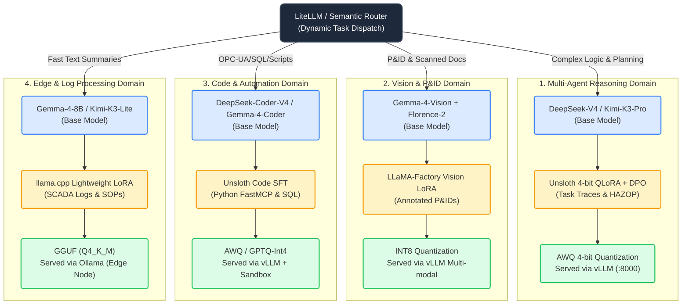

```mermaid
graph TD
    %% Styling Definitions
    classDef router fill:#1E293B,color:#FFFFFF,stroke:#334155,stroke-width:2px,rx:8px
    classDef domainHeader fill:#F1F5F9,stroke:#94A3B8,stroke-width:2px,rx:5px
    classDef modelBox fill:#DBEAFE,stroke:#3B82F6,stroke-width:2px,rx:4px
    classDef trainBox fill:#FEF3C7,stroke:#F59E0B,stroke-width:2px,rx:4px
    classDef deployBox fill:#DCFCE7,stroke:#22C55E,stroke-width:2px,rx:4px
    classDef edgeLabel fill:#FFFFFF,stroke:#CBD5E1,stroke-width:1px,rx:4px

    %% Core Router
    Router["LiteLLM / Semantic Router<br/>(Dynamic Task Dispatch)"]:::router

    %% Domains
    Router -->|Complex Logic & Planning| D1_Base
    Router -->|P&ID & Scanned Docs| D2_Base
    Router -->|OPC-UA/SQL/Scripts| D3_Base
    Router -->|Fast Text Summaries| D4_Base

    %% Branch 1: Reasoning
    subgraph Domain_1 ["1. Multi-Agent Reasoning Domain"]
        D1_Base["DeepSeek-V4 / Kimi-K3-Pro<br/>(Base Model)"]:::modelBox
        D1_Train["Unsloth 4-bit QLoRA + DPO<br/>(Task Traces & HAZOP)"]:::trainBox
        D1_Deploy["AWQ 4-bit Quantization<br/>Served via vLLM (:8000)"]:::deployBox
        
        D1_Base --> D1_Train --> D1_Deploy
    end

    %% Branch 2: Vision
    subgraph Domain_2 ["2. Vision & P&ID Domain"]
        D2_Base["Gemma-4-Vision + Florence-2<br/>(Base Model)"]:::modelBox
        D2_Train["LLaMA-Factory Vision LoRA<br/>(Annotated P&IDs)"]:::trainBox
        D2_Deploy["INT8 Quantization<br/>Served via vLLM Multi-modal"]:::deployBox
        
        D2_Base --> D2_Train --> D2_Deploy
    end

    %% Branch 3: Code
    subgraph Domain_3 ["3. Code & Automation Domain"]
        D3_Base["DeepSeek-Coder-V4 / Gemma-4-Coder<br/>(Base Model)"]:::modelBox
        D3_Train["Unsloth Code SFT<br/>(Python FastMCP & SQL)"]:::trainBox
        D3_Deploy["AWQ / GPTQ-Int4<br/>Served via vLLM + Sandbox"]:::deployBox
        
        D3_Base --> D3_Train --> D3_Deploy
    end

    %% Branch 4: Edge
    subgraph Domain_4 ["4. Edge & Log Processing Domain"]
        D4_Base["Gemma-4-8B / Kimi-K3-Lite<br/>(Base Model)"]:::modelBox
        D4_Train["llama.cpp Lightweight LoRA<br/>(SCADA Logs & SOPs)"]:::trainBox
        D4_Deploy["GGUF (Q4_K_M)<br/>Served via Ollama (Edge Node)"]:::deployBox
        
        D4_Base --> D4_Train --> D4_Deploy
    end
```
